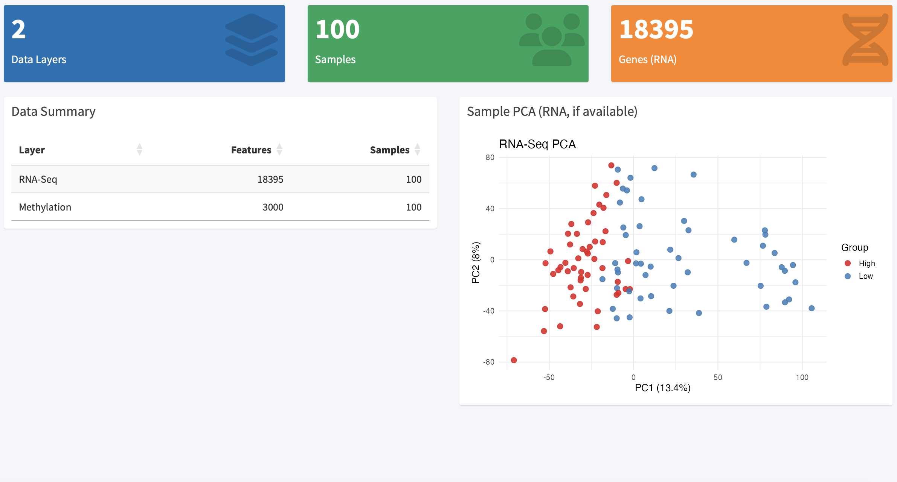
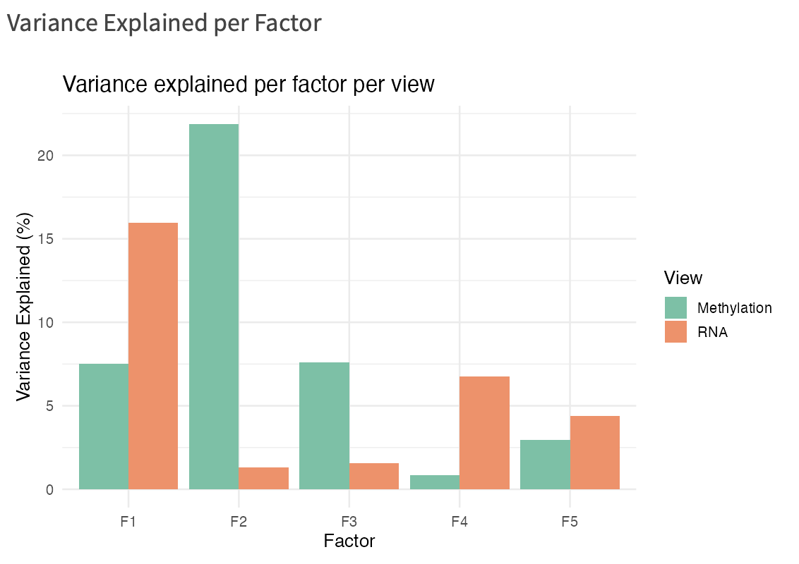
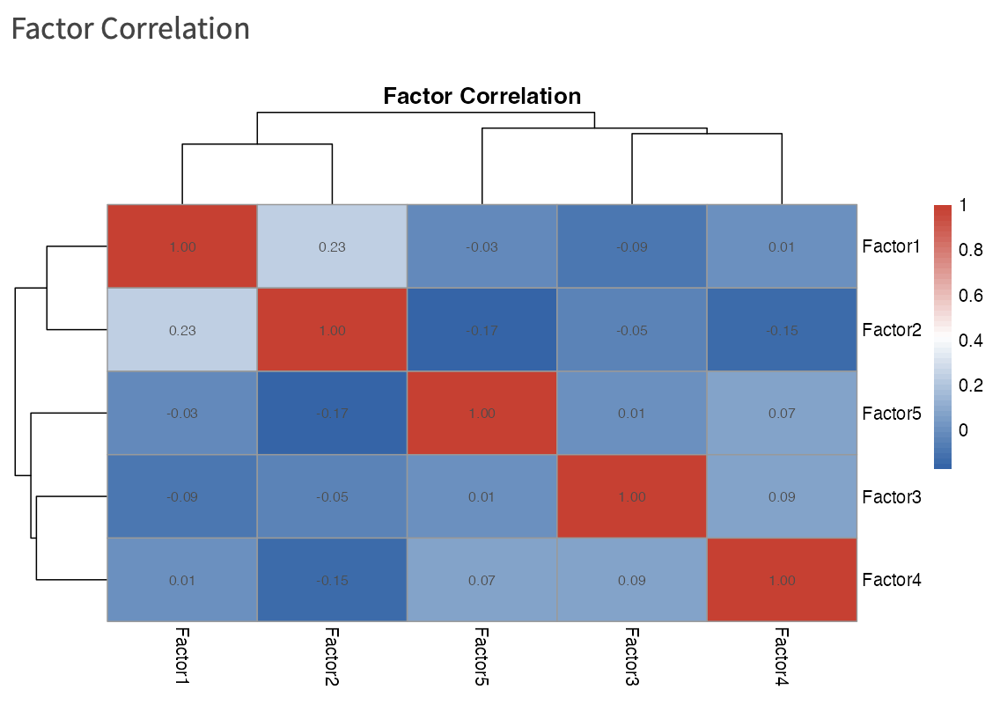
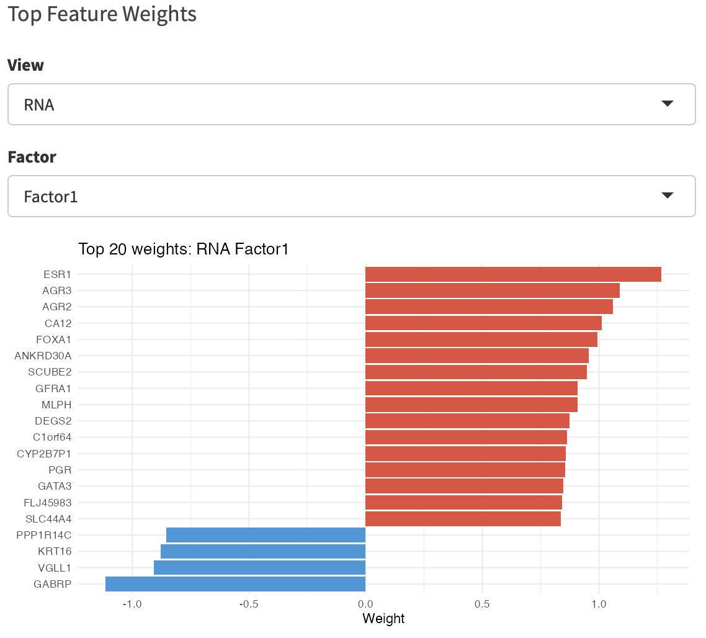
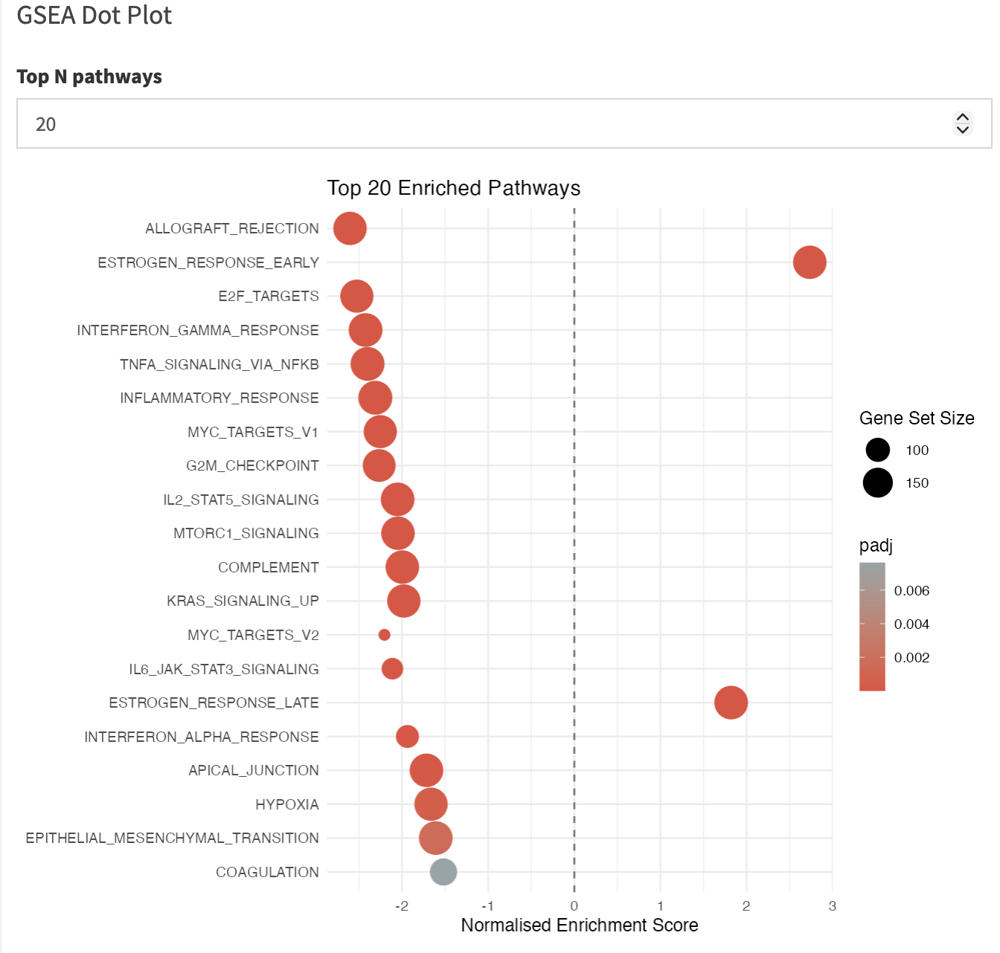

# OmicsLens

> **Multi-omics integration and visualization for translational research**

[](https://github.com/omicsedgebio/OmicsLens/actions)
[](LICENSE.md)
[](https://doi.org/10.5281/zenodo.20346578)

---

OmicsLens is an R package that combines **RNA-Seq**, **whole-genome sequencing (WGS)**,
and **DNA methylation** data into a single interpretable analysis. The core engine is
[MOFA2](https://biofam.github.io/MOFA2/) latent factor analysis; results are explored
through an interactive **Shiny dashboard** and exported as a reproducible **HTML report**.

No bioinformatics PhD required.

---

## Package architecture

<p align="center">
  
</p>

---

## Why OmicsLens?

| Feature | MOFA2 alone | DESeq2 alone | **OmicsLens** |
|---|---|---|---|
| Combines RNA + WGS + Methylation | ✅ | ❌ | ✅ |
| Accessible 5-function API | ❌ | N/A | ✅ |
| Built-in DE, GSEA, DMR, survival | ❌ | Partial | ✅ |
| Interactive Shiny dashboard | ❌ | ❌ | ✅ |
| One-click HTML report | ❌ | ❌ | ✅ |

---

## Validated on real public datasets

### TCGA-BRCA — 100 primary breast tumours

Downloaded via [`curatedTCGAData`](https://bioconductor.org/packages/curatedTCGAData/).

| Layer | Dimensions | Source |
|---|---|---|
| RNA-Seq (VST-normalised) | 18,395 genes × 100 samples | TCGA RNASeqGene |
| DNA methylation (27k) | 3,000 top-variable CpGs × 100 samples | TCGA Methylation27k |
| Clinical metadata | Survival time, vital status | TCGA clinical XML |

### Airway — GSE52778 (8 samples)

Downloaded via the [`airway`](https://bioconductor.org/packages/airway/) Bioconductor package (Himes et al. 2014).

| Layer | Dimensions | Source |
|---|---|---|
| RNA-Seq | 17,199 genes × 8 samples | SRP033351 |

---

## Example outputs & results interpretation

### Overview dashboard

<p align="center">
  
</p>

The overview tab shows **2 data layers** (RNA + methylation), **100 samples**, and **18,395 genes**.
The RNA-Seq PCA separates samples into **High** (red) and **Low** (blue) groups along PC1 (13.4%),
confirming biologically meaningful structure before any integration.

---

### MOFA2 — Variance explained per factor

<p align="center">
  
</p>

MOFA2 learned **5 latent factors** jointly across RNA and methylation:

- **Factor 1** captures primarily **RNA variation (16.1%)** with moderate methylation contribution (7.7%) — this is the main expression-driven axis separating tumour subtypes.
- **Factor 2** is dominated by **methylation (22.1%)**, with minimal RNA loading (1.2%) — representing an epigenetic axis largely independent of transcription.
- **Factors 3–5** capture additional layer-specific variance at lower levels.

### MOFA2 — Factor correlation

<p align="center">
  
</p>

All off-diagonal correlations are near zero (max r = 0.23 between F1 and F2), confirming the
factors are **statistically independent** — each captures a distinct biological signal, as
expected from MOFA2's orthogonality constraint.

### MOFA2 — Factor scatter & top feature weights

<p align="center">
  
</p>

Factor 1 cleanly separates **High** (ER+/luminal) from **Low** (ER−/basal) tumours along the
x-axis. Factor 2 shows no group structure, consistent with its methylation-driven nature.

<p align="center">
  
</p>

The top RNA weights for Factor 1 tell a precise biological story:

| Direction | Top genes | Biology |
|---|---|---|
| **Positive (High group)** | ESR1, AGR3, AGR2, CA12, FOXA1, PGR, GATA3 | ER+ / luminal A/B breast cancer markers |
| **Negative (Low group)** | GABRP, VGLL1, KRT16, PPP1R14C | Basal-like / triple-negative markers |

**ESR1** (estrogen receptor α) is the single highest-weight gene — Factor 1 has recovered the
canonical ER+/ER− axis of BRCA without any prior knowledge of tumour subtype.

---

### Differential expression — Volcano plot

<p align="center">
  
</p>

DESeq2 identified **8,336 differentially expressed genes** (padj < 0.05, |log2FC| > 1)
between MOFA Factor 1 High and Low groups. The volcano is strongly asymmetric — a large
cluster of downregulated genes (blue, left) with very high significance (−log10 padj > 20)
reflects the suppression of immune and proliferative programmes in the ER+ High group.
Upregulated genes (red) include estrogen-responsive targets.

---

### Pathway enrichment — GSEA

<p align="center">
  
</p>

**25 Hallmark pathways** were significantly enriched (padj < 0.05). Key findings:

| Direction | Top pathways | Interpretation |
|---|---|---|
| **Enriched in High (ER+)** | ESTROGEN_RESPONSE_EARLY (NES +3.2), ESTROGEN_RESPONSE_LATE (NES +1.8) | Confirms ER+ identity; strong oestrogen signalling |
| **Depleted in High (ER+)** | ALLOGRAFT_REJECTION (NES −2.2), INTERFERON_GAMMA_RESPONSE, E2F_TARGETS, G2M_CHECKPOINT, MYC_TARGETS_V1/V2, TNFA_SIGNALING_VIA_NFKB | Basal/TNBC tumours (Low group) are more proliferative and immunologically active |

The enrichment of proliferative (E2F, G2M, MYC) and immune-inflammatory (Interferon, TNFA, Allograft rejection)
pathways in the Low (basal-like) group is fully consistent with published BRCA biology.

---

### Survival analysis — Kaplan-Meier & Cox regression

<p align="center">
  
</p>

The KM curves show a **survival trend** consistent with known BRCA subtype prognosis:
the **Low group** (basal-like) drops to ~32% survival by day 4,300, while the **High group**
(ER+/luminal) maintains ~83% survival probability.

**Cox proportional hazards model:**

```
n = 100 samples,  events = 11

                 coef   exp(coef)   p-value
mofa_groupLow  −0.10     0.90       0.875

Concordance = 0.578
Likelihood ratio test p = 0.9
```

The Cox model is **not statistically significant** — this is expected and biologically honest:
only **11 of 100 patients died** during follow-up (TCGA-BRCA has excellent short-term
prognosis; long-term outcomes require >5-year follow-up). The concordance of 0.578 (vs 0.5
for random) and the visible KM divergence indicate a **real but underpowered survival signal**.
Larger cohorts or extended follow-up would be needed to reach significance.

---

## Installation

```r
# 1. Install Bioconductor dependencies
if (!requireNamespace("BiocManager", quietly = TRUE))
  install.packages("BiocManager")
BiocManager::install(c("MOFA2", "DESeq2", "fgsea"))

# 2. Install OmicsLens from GitHub
devtools::install_github("omicsedgebio/OmicsLens")
```

---

## Quick start

```r
library(OmicsLens)

obj <- omicslens_load(
  rna_counts  = "counts_matrix.csv",
  variants    = "mutations.maf",
  methylation = "beta_matrix.csv",
  metadata    = "sample_info.csv"
)
obj <- omicslens_preprocess(obj)
obj <- omicslens_integrate(obj, n_factors = 10)
obj <- omicslens_analyze(obj, survival_time_col = "time_os", survival_event_col = "event")

omicslens_app(obj)                                       # interactive dashboard
omicslens_report(obj, output_file = "report.html")       # HTML report
```

---

## Input formats

| Layer | Accepted formats |
|---|---|
| RNA-Seq | CSV / TSV / RDS — raw integer count matrix (genes × samples) |
| Variants | MAF file (`.maf`) or binary CSV/TSV (samples × genes) |
| Methylation | CSV / TSV / RDS — Illumina 450k/EPIC/27k beta matrix (CpGs × samples) |
| Metadata | CSV with `sample_id`; add `time_os` + `event` for survival |

---

## Shiny dashboard tabs

1. **Overview** — data dimensions, RNA-Seq PCA
2. **MOFA2 Factors** — variance explained, factor correlation, scatter, top weights
3. **Differential Expression** — volcano plot, heatmap, sortable table
4. **Pathway Enrichment** — GSEA dot plot, results table
5. **Methylation / DMR** — differentially methylated CpGs
6. **Survival** — Kaplan-Meier curves, Cox regression summary
7. **Export** — download CSVs; generate HTML report

---

## Citation

> Pathak, P. (2026). *OmicsLens: Multi-Omics Integration Pipeline with
> Interactive Visualization* (v0.1.0). Zenodo. https://doi.org/10.5281/zenodo.20346578

> Argelaguet R et al. (2020). MOFA+: a statistical framework for comprehensive integration
> of multi-modal single-cell data. *Genome Biology*, 21:111.

---

## Contributing

Issues and PRs welcome at <https://github.com/omicsedgebio/OmicsLens/issues>.

---

## License

MIT — Copyright (c) 2026 Priyansh Pathak, OmicEdgeBio
