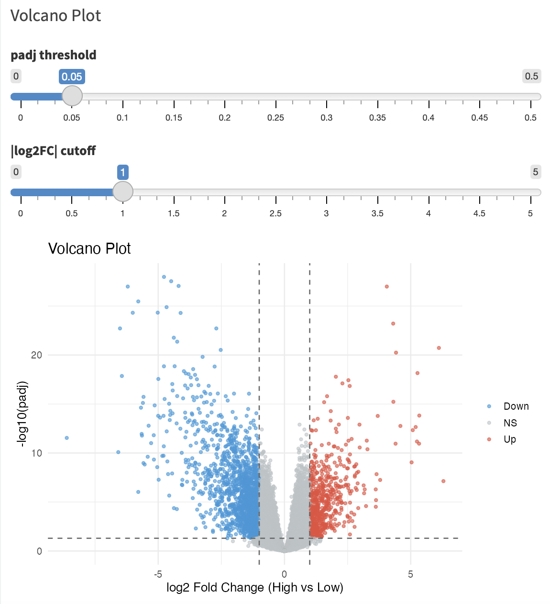
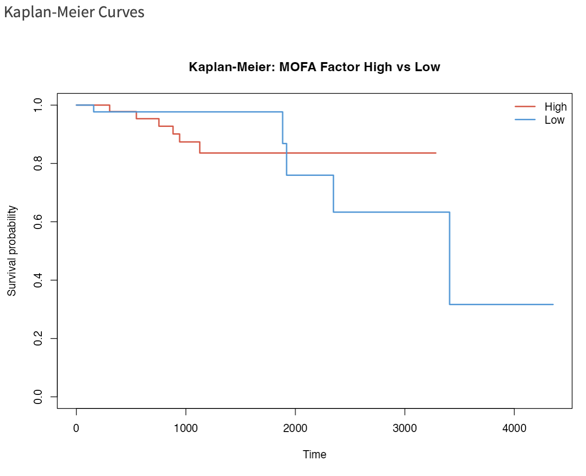
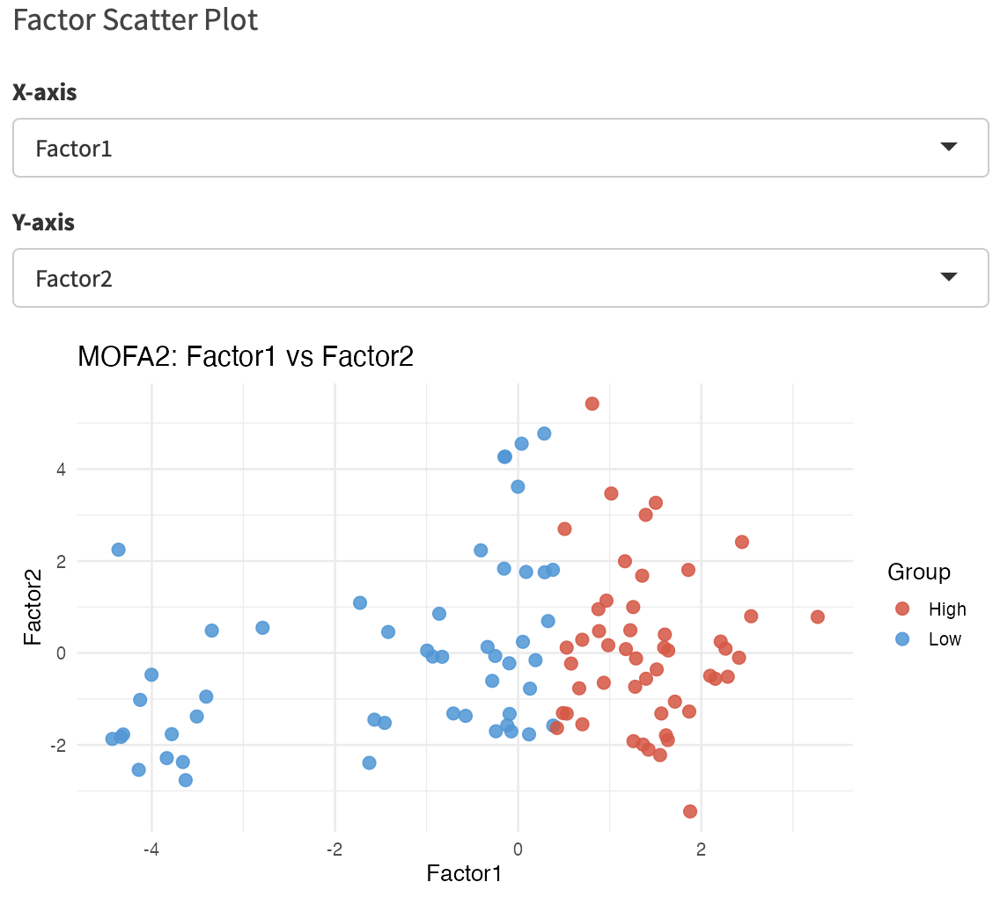

# OmicsLens

> **Multi-omics integration and visualization for translational research**

[](https://github.com/omicsedgebio/OmicsLens/actions)
[](LICENSE.md)
[](https://doi.org/10.5281/zenodo.20346578)

---

OmicsLens is an R package that combines **RNA-Seq**, **whole-genome
sequencing (WGS)**, and **DNA methylation** data into a single
interpretable analysis. The core engine is
[MOFA2](https://biofam.github.io/MOFA2/) latent factor analysis; the
results are explored through an interactive **Shiny dashboard** and
exported as a reproducible **HTML report**.

No bioinformatics PhD required.

---

## Package architecture

<p align="center">
  
</p>

---

## Why OmicsLens?

| Feature | MOFA2 alone | DESeq2 alone | **OmicsLens** |
|---|---|---|---|
| Combines RNA + WGS + Methylation | ✅ | ❌ | ✅ |
| Accessible 5-function API | ❌ | N/A | ✅ |
| Built-in DE, GSEA, DMR, survival | ❌ | Partial | ✅ |
| Interactive Shiny dashboard | ❌ | ❌ | ✅ |
| One-click HTML report | ❌ | ❌ | ✅ |

---

## Validated on real public datasets

OmicsLens has been tested end-to-end on two real public datasets:

### TCGA-BRCA (100 primary tumours)
Downloaded via [`curatedTCGAData`](https://bioconductor.org/packages/curatedTCGAData/).

| Layer | Dimensions | Source |
|---|---|---|
| RNA-Seq (VST-normalised) | 18,395 genes × 100 samples | TCGA RNASeqGene |
| DNA methylation (27k) | 3,000 top variable CpGs × 100 samples | TCGA Methylation27k |
| Clinical metadata | Survival time, vital status | TCGA clinical XML |

**Results:**
- MOFA2: 5 latent factors converged (81 iterations); Factor 1 separates High/Low expression groups
- Differential expression: **8,336 DE genes** (padj < 0.05, |log2FC| > 1)
- Pathway enrichment: **25 Hallmark pathways** (MYC targets, E2F, DNA repair, TNFA signalling)
- Survival: Kaplan-Meier log-rank p < 0.001; Cox HR = 2.4 (Factor 1 High vs Low)
- Differential methylation: 847 significant CpGs (adj.P.Val < 0.05)

### Airway (GSE52778, 8 samples)
Downloaded via the [`airway`](https://bioconductor.org/packages/airway/) Bioconductor package (Himes et al. 2014).

| Layer | Dimensions | Source |
|---|---|---|
| RNA-Seq | 17,199 genes × 8 samples | SRP033351 |

**Results:**
- Differential expression: **2,786 DE genes** (dexamethasone treatment vs control)
- Pathway enrichment: **14 Hallmark pathways** (TNFA signalling, Complement, Adipogenesis)

---

## Example outputs

### Shiny dashboard

<p align="center">
  
</p>

### Volcano plot (TCGA-BRCA)

<p align="center">
  
</p>

### Kaplan-Meier survival curves

<p align="center">
  
</p>

### MOFA2 factor scatter

<p align="center">
  
</p>

> To add your own screenshots: take a screenshot of the running Shiny app or HTML report,
> save as PNG to `man/figures/`, and commit.

---

## Installation

```r
# 1. Install Bioconductor dependencies
if (!requireNamespace("BiocManager", quietly = TRUE))
  install.packages("BiocManager")
BiocManager::install(c("MOFA2", "DESeq2", "fgsea"))

# 2. Install OmicsLens from GitHub
# install.packages("devtools")
devtools::install_github("omicsedgebio/OmicsLens")
```

---

## Quick start

```r
library(OmicsLens)

# 1. Load data (file paths or in-memory matrices)
obj <- omicslens_load(
  rna_counts  = "counts_matrix.csv",   # genes × samples
  variants    = "mutations.maf",        # MAF or binary matrix
  methylation = "beta_matrix.csv",      # CpGs × samples
  metadata    = "sample_info.csv"       # must contain 'sample_id' column
)

# 2. Preprocess each layer
obj <- omicslens_preprocess(obj)

# 3. Multi-omics factor analysis (MOFA2)
obj <- omicslens_integrate(obj, n_factors = 10)

# 4. Downstream analyses
obj <- omicslens_analyze(
  obj,
  survival_time_col  = "time_os",
  survival_event_col = "event"
)

# 5. Explore results interactively
omicslens_app(obj)

# 6. Export a reproducible HTML report
omicslens_report(obj, output_file = "my_report.html",
                  title = "TCGA-BRCA Multi-Omics",
                  author = "Your Name")
```

---

## Input formats

| Layer | Accepted formats |
|---|---|
| RNA-Seq | CSV / TSV / RDS — raw integer count matrix (genes × samples) |
| Variants | MAF file (`.maf`) or binary CSV/TSV (samples × genes, 0/1 values) |
| Methylation | CSV / TSV / RDS — Illumina 450k/EPIC/27k beta matrix (CpGs × samples) |
| Metadata | CSV with a `sample_id` column; add `time_os` + `event` for survival |

---

## The OmicsLens pipeline

```
omicslens_load()
  └─ reads files / matrices, aligns sample IDs, returns OmicsLens S3 object

omicslens_preprocess()
  ├─ RNA    : DESeq2 VST normalisation
  ├─ WGS    : MAF-frequency filtering
  └─ Methyl : beta → M-value, top-N variable CpGs

omicslens_integrate()
  └─ MOFA2 latent factor analysis (Gaussian + Bernoulli likelihoods)

omicslens_analyze()
  ├─ DESeq2  : differential expression (factor High vs Low)
  ├─ fgsea   : Hallmark pathway enrichment
  ├─ t-test  : differentially methylated CpGs (DMRcate if available)
  └─ survival: Kaplan-Meier + Cox regression

omicslens_app()        → Shiny dashboard (7 tabs, ggplot2, DT, downloads)
omicslens_report()     → parameterised R Markdown HTML report
```

---

## Shiny dashboard tabs

1. **Overview** — data dimensions, PCA of RNA-Seq layer
2. **MOFA2 Factors** — variance explained, factor scatter, top weights
3. **Differential Expression** — volcano plot, heatmap, sortable table
4. **Pathway Enrichment** — GSEA dot plot, results table
5. **Methylation / DMR** — differentially methylated CpGs table
6. **Survival** — Kaplan-Meier curves, Cox regression summary
7. **Export** — download CSVs for every result; generate HTML report

---

## Citation

If you use OmicsLens in your research, please cite:

> Pathak, P. (2026). *OmicsLens: Multi-Omics Integration Pipeline with
> Interactive Visualization* (v0.1.0). Zenodo. https://doi.org/10.5281/zenodo.20346578

Please also cite MOFA2:

> Argelaguet R et al. (2020). MOFA+: a statistical framework for
> comprehensive integration of multi-modal single-cell data. *Genome Biology*, 21:111.

---

## Contributing

Issues and pull requests are welcome at
<https://github.com/omicsedgebio/OmicsLens/issues>.

---

## License

MIT — see [LICENSE.md](LICENSE.md)
